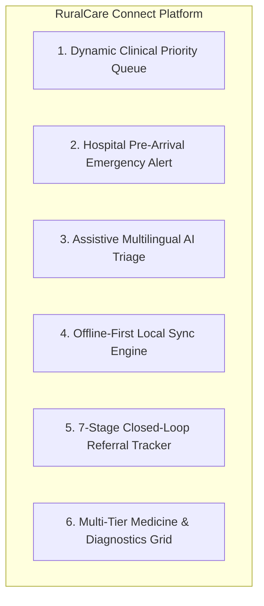

# 🩺 RuralCare Connect — "Right Care. Right Place. Right Time."

**Smart India Hackathon 2026 | Problem Statement ID: SIH26133**  
**Theme:** MedTech / BioTech / HealthTech | **Target Entity:** Public Health & Family Welfare Department, Government of Maharashtra  
**Focal Geography:** Karegaon PHC, Shirur Taluka, Pune District, Maharashtra  

---

## 📌 Executive Summary & Vision

Rural and underserved communities face acute challenges: long travel distances to hospitals, critical shortages of specialists, irregular diagnostic coverage, fragmented paper medical records, delayed referrals, medicine stock-outs, long waiting times, limited service awareness, poor connectivity, and language barriers.

**RuralCare Connect** is an integrated healthcare-access and quality-support platform built to **strengthen and augment India's existing 3-tier public healthcare delivery system** (Sub-Centres → PHCs → CHCs/Sub-District Hospitals → District Hospitals) rather than attempting to bypass or replace it.

---

## 🌟 The 6 Core Innovations



1. **Dynamic Clinical Priority Queue:** Clinician-governed queue reordering (`Critical > Urgent > Priority > Routine`). Emergency triage upgrades instantly bump critical patients to Token #1.
2. **Pre-Arrival Hospital Emergency Alert:** Real-time bi-directional telemetry between 108 ALS ambulances and receiving hospital emergency rooms. Doctors receive incoming patient vitals, ECG, and tentative diagnosis before the wheels touch the hospital bay.
3. **Assistive Multilingual AI Triage:** Structured symptom assessment with voice simulation in English, Marathi, Hindi, and Telugu. Strictly operates as clinical decision support with mandatory qualified doctor validation.
4. **Offline-First Local Sync Engine:** Frontline ASHAs and ANMs in connectivity-shadowed hamlets can register citizens and record vitals locally; records sync seamlessly upon reconnection.
5. **7-Stage Closed-Loop Referral Tracking:** Tracks patients across inter-tier transfers (`Created → Accepted → Scheduled → Patient En Route → Arrived → Consulted → Completed`), preventing patient drop-offs.
6. **Multi-Tier Medicine & Diagnostics Grid:** Real-time stock visibility across Sub-Centres, PHCs, CHCs, and District Hospitals, paired with digital diagnostic slot scheduling and automated report generation.

---

## 👥 6 Dedicated Stakeholder Personas (1-Click Demo Login)

| Role | Demo Persona | Facility / Scope | Primary Operational Responsibilities |
|---|---|---|---|
| **Patient / Citizen** | Ramesh Patil (Age 48) | Karegaon Village | Voice/AI Triage, Doorstep Visit, OPD Queue Token, Digital Rx, 108 Emergency SOS |
| **Frontline Health Worker** | Lakshmi Devi (ASHA) | Sub-Centre Karegaon | Offline Registration, Doorstep Vitals, Maternal/NCD High-Risk Monitoring |
| **Medical Officer / Doctor** | Dr. Priya Sharma (MBBS, DNB) | Karegaon PHC | Priority Queue Management, Urgency Escalation, Digital Rx Builder, Specialist Referrals |
| **108 Ambulance Driver** | Rajesh Driver (ALS Unit 14) | Shirur Taluka EMS | Capability Hospital Matching, GPS Navigation, Pre-Arrival Triage Broadcast |
| **Hospital Admin / MS** | Dr. Sunita Kulkarni | Shirur Sub-District Hospital | Pre-Arrival Alert Command, Emergency Bed Allocation, Specialist Rosters |
| **District Health Admin** | Dr. Vilas Rao (DHO) | Pune District Health Office | Taluka Heatmaps, Maternal Mortality Trackers, Stock Deficits, Real-Time Audit Log |

---

## ⚖️ SIH Judge Presentation Mode & Evaluation Tools

Anchored permanently in the **Judge Demo Bar** (bottom right of every screen) are direct interactive tools designed specifically for hackathon evaluators:

1. **🎯 19-Stage Interactive "Rural Patient Emergency Journey" (`JudgeScenarioModal`):**
   Step through a realistic acute cardiac case from symptom onset in Karegaon village, ASHA doorstep check, 108 dispatch, pre-arrival hospital prep, specialist consultation, diagnostic ECG, priority queue escalation, and post-discharge home care.
2. **💡 "Why RuralCare?" Innovation Matrix (`InnovationsModal`):**
   Detailed deep-dive into the 6 core innovations and 5 architectural pillars.
3. **📋 SIH Problem Statement Alignment Matrix (`SihAlignmentModal`):**
   Comprehensive 10-point mapping proving exact alignment with problem statement SIH26133.
4. **🏗️ 7-Tier Technical Architecture Diagram (`TechArchitectureModal`):**
   Full architectural layout from edge offline caching to national ABDM & 108 CAD integration.

---

## 🚀 How to Run Locally

### Prerequisites
- Node.js (v18+ or v20+)
- npm (v9+ or v10+)

### Commands
```bash
# 1. Navigate to the project directory
cd C:\Users\akshu\.gemini\antigravity\scratch\ruralcare-connect

# 2. Start local development server
npm run dev

# 3. Access in your browser
http://127.0.0.1:5173/

# 4. Production Build Verification
npm run build
```

---

## 📁 Repository Structure

```
ruralcare-connect/
├── public/
├── src/
│   ├── assets/              # Branding and icons
│   ├── components/
│   │   ├── admin/           # District Health Officer Command Center (Pune)
│   │   ├── ambulance/       # 108 ALS Ambulance Driver Console & Pre-Arrival Broadcast
│   │   ├── auth/            # 6-Role Card Grid & 1-Click Persona Switcher
│   │   ├── common/          # Navbar, Footer, Language Selector, LeafletMap, Offline Banner
│   │   ├── doctor/          # Dynamic Priority Queue, Consultation Room & Rx Builder
│   │   ├── emergency/       # 108 Emergency SOS Dispatch & Nearest Facility Matching
│   │   ├── healthworker/    # ASHA Console, Offline Patient Registration, Household Registry
│   │   ├── highrisk/        # Maternal, Child & NCD High-Risk Follow-up Modal
│   │   ├── hospital/        # Hospital Admin Dashboard & Incoming Pre-Arrival Banner
│   │   ├── judge/           # 19-Stage Walkthrough, Innovations, SIH Alignment, Tech Architecture
│   │   ├── landing/         # Public Portal, Vision, Multi-Tier Care Pathway & Statistics
│   │   └── patient/         # Care Near Me, Doorstep Visit, Voice/AI Triage, Rx, Diagnostics
│   ├── context/             # Auth (6 Roles), Network (Offline mode), Language (4 Langs), Notifications
│   ├── data/                # Realistic Pune/Shirur Datasets & Multilingual Dictionaries
│   ├── services/            # Dynamic Queue, Triage, Referral, Emergency, Diagnostics, Offline Sync
│   ├── types/               # Full TypeScript Domain Schema
│   ├── App.tsx              # Main Orchestration & Global State
│   ├── index.css            # Tailwind Styles & Print Styles
│   └── main.tsx             # React Root
├── index.html
├── package.json
├── tailwind.config.js
├── tsconfig.json
└── vite.config.ts
```

---

## 🔒 Security, Ethics & Clinical Safety Compliance

- **Non-Autonomous AI Decision Support:** All triage suggestions explicitly carry a statutory advisory stating that clinical decisions remain the sole prerogative of registered medical practitioners.
- **ABDM Compliance:** Designed according to NDHM (National Digital Health Mission) M1, M2, and M3 standards for ABHA ID generation, consent artifacts, and FHIR resource representation.
- **Zero Lock-In Public Infrastructure:** Built entirely on open-source web technologies and OpenStreetMap with zero mandatory proprietary cloud API dependencies.

---

**Built with pride for Smart India Hackathon 2026.**  
*Government of Maharashtra • Directorate of Health Services*
